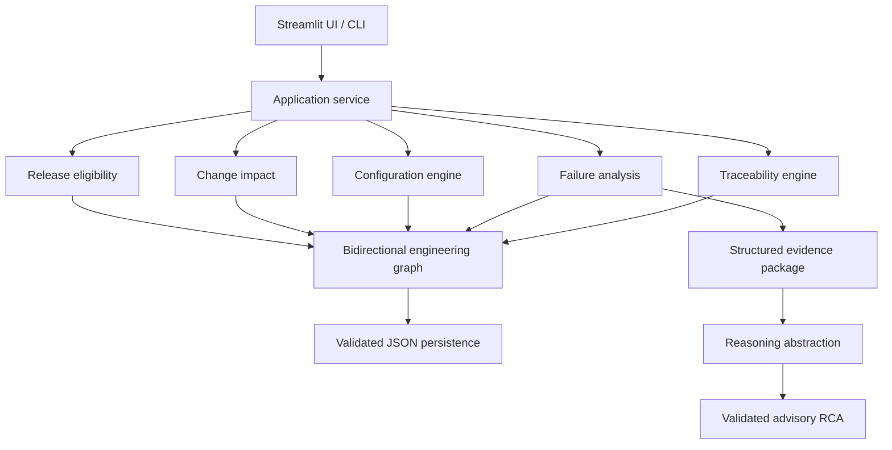
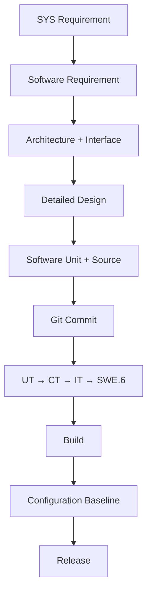

# TraceAI — Engineering Intelligence Copilot

**AI-assisted ASPICE digital thread, configuration management, traceability,
change impact, release intelligence, and evidence-backed root-cause analysis.**

TraceAI is a standalone four-day proof of concept for automotive engineering. Its hero
workflow is:

> Enter a Requirement ID → reconstruct the complete engineering digital thread → find
> missing links and failed verification → detect configuration mismatches → retrieve
> engineering evidence → generate advisory root-cause hypotheses → explain build, baseline,
> and release impact.

The application demonstrates ASPICE-oriented concepts. It does **not** assess, certify, or
claim formal Automotive SPICE compliance.

## Problem

Engineering information is commonly fragmented across requirements, architecture, design,
source control, test management, configuration management, defect tracking, and release
tools. A requirement may appear implemented while its verification is missing, its baseline
contains a stale version, or its release includes an unresolved failure.

A generic LLM cannot safely reconstruct these relationships from a Requirement ID. TraceAI
therefore uses deterministic services for engineering truth and AI only for advisory,
evidence-grounded explanation.

## PoC objective

Given `SWE-REQ-014`, answer:

- Which system requirement is upstream?
- Which architecture components, interfaces, designs, units, and files implement it?
- Which commit, build, baseline, and release contain it?
- Where are trace links missing?
- Which verification stage failed first?
- How does that failure propagate toward release?
- Are artifact versions and baselines consistent?
- Which defect and change request are related?
- What is the probable root cause, based only on retrieved evidence?
- Is the release deterministically eligible?

## ASPICE concepts represented

| Process | PoC representation |
| --- | --- |
| SWE.1 | Versioned software requirements and quality checks |
| SWE.2 | Architecture components and interface contracts |
| SWE.3 | Detailed designs, software units, source files, commits |
| SWE.4 | Unit-verification links and results |
| SWE.5 | Component and integration verification |
| SWE.6 | Software-verification evidence and blocking |
| SUP.8 | Versions, baselines, builds, releases, mismatch detection |
| SUP.9 | Test execution → defect history |
| SUP.10 | Requirement/defect → change request → corrective commit |
| SPL.2 | Release content and deterministic eligibility |

## Architecture



The graph implementation is dependency-free and in memory. Persistence is separated behind
a validated JSON loader, making later ALM or graph-database adapters possible without
changing the deterministic engines.

## Engineering digital thread



Supporting links connect failed test executions to defects, defects to change requests,
change requests to corrective commits, and commits to corrected builds and retest history.
All graph navigation is bidirectional.

## Configuration management

Every artifact has a controlled ID, version, status, revision, timestamps, and optional
baseline/approval metadata. Configuration checks are deterministic:

- `ARCH-COMP-004` expects `ARCH-IF-006 v2.0`, but the supplied interface is `v2.1`.
- `SWE-REQ-014` belongs to `REQ-BL-13`, but `BUILD-158` uses `REQ-BL-12`.
- `REQ-BL-12` contains `SWE-REQ-014 v3.1`, while the current requirement is `v3.2`.

The LLM abstraction may explain these facts but cannot create or override them.

## Failure and root-cause intelligence

The synthetic scenario deliberately produces:

```text
UT-034       PASS
UT-035       PASS
CT-012       PASS
IT-045       FAIL       expected ALIGNED, received VALID
SWE6-VT-008 BLOCKED
BUILD-158    NOT RELEASE ELIGIBLE
REL-1.4.0    AT RISK
```

The failure service identifies integration as the first failing V-model level, retrieves the
interface versions, commits, source files, test history, defect, and change request, then
constructs a typed evidence package. The reasoning service returns a **probable** interface
contract inconsistency with evidence IDs and recommended engineering checks.

An offline deterministic reasoning fallback is the default. An external LLM adapter can be
added later behind the same protocol, and its Pydantic output must satisfy the same contract.

## Change and release intelligence

`CR-091` traversal groups all affected artifacts and identifies those whose `updated_at`
pre-dates the change. Release eligibility is blocked unless all deterministic conditions hold:

1. No critical traceability gaps
2. No failed or blocked mandatory verification
3. No unresolved blocking defects
4. No configuration mismatch affecting the release

AI does not decide release eligibility.

## Human-in-the-loop AI

Every RCA records:

- reasoning model/adapter name;
- prompt contract version;
- generation timestamp;
- input evidence IDs;
- confidence wording;
- review state (`PROPOSED`, `ACCEPTED`, `MODIFIED`, or `REJECTED`).

The PoC never updates approved engineering artifacts or baselines.

## Synthetic sample scenario

`data/engineering_data.json` contains 49 artifacts and 58 relationships for an automated EV
charging system. It includes:

- a failing alignment/charging integration thread (`SWE-REQ-014`);
- missing design, commit, and unit-verification links;
- a stale requirements baseline and interface mismatch;
- failed and successful `IT-045` executions;
- `DEFECT-023 → CR-091 → COMMIT-c821ac → BUILD-162`;
- blocked `REL-1.4.0` and corrective candidate `REL-1.4.1`;
- a separate fully traced and released scenario (`SWE-REQ-030 → REL-1.5.0`).

The dataset is fictional and contains no Easelink or other company-confidential information.

## Repository structure

```text
traceai/
├── app.py                         # Streamlit dashboard
├── data/
│   ├── engineering_data.json      # Digital-thread scenario
│   └── requirements.csv           # Preserved SWE.1 quality sample
├── src/traceai/
│   ├── engineering_models.py      # Artifact, edge, report contracts
│   ├── engineering_loader.py      # Validated persistence adapter
│   ├── engineering_graph.py       # Bidirectional traversal
│   ├── traceability.py            # Missing links and coverage
│   ├── configuration.py           # Version/baseline consistency
│   ├── failure_analysis.py        # Evidence and failure localization
│   ├── change_impact.py           # Change traversal/staleness
│   ├── release.py                 # Release eligibility rules
│   ├── reasoning.py               # AI protocol and offline fallback
│   ├── intelligence.py            # Hero application use case
│   └── analyzer.py                # Preserved requirement-quality engine
├── tests/
│   ├── unit/
│   ├── integration/
│   └── verification/
├── docs/
│   ├── BUILD_ALONG_DAY_1.md
│   ├── COMPLETE_BUILD_TUTORIAL.md
│   ├── requirements/
│   ├── architecture/
│   ├── design/
│   ├── verification/
│   ├── traceability/
│   └── configuration/
├── Dockerfile
├── Makefile
└── pyproject.toml
```

## Installation

Prerequisites: Git, Python 3.11 or 3.12, and
[`uv`](https://docs.astral.sh/uv/getting-started/installation/).

```bash
git clone https://github.com/<your-user>/traceai.git
cd traceai
uv sync --extra dev
```

## Run the hero analysis

```bash
uv run traceai trace SWE-REQ-014 \
  --data data/engineering_data.json \
  --release-id REL-1.4.0 \
  --change-request-id CR-091 \
  --output outputs/engineering_intelligence_report.json
```

Expected console summary:

```text
ENGINEERING INTELLIGENCE REPORT
Requirement: SWE-REQ-014 v3.2
Overall: BLOCKED
Traceability: 87.8%
Verification: 60.0%
Configuration mismatches: 3
First failure: IT-045
Release REL-1.4.0: BLOCKED
Probable root cause: Evidence indicates a probable interface-contract inconsistency ...
```

The exact structured evidence is written to
`outputs/engineering_intelligence_report.json`.

The original requirements-quality command remains available:

```bash
uv run traceai analyze --input data/requirements.csv --output-dir outputs
```

## Run the dashboard

```bash
uv run streamlit run app.py
```

Open `http://localhost:8501`, enter `SWE-REQ-014`, and select **Analyse**. Try
`SWE-REQ-030` to compare the healthy released thread.

## Run tests and quality gates

```bash
make test-unit
make test-integration
make test-verification
make coverage
make lint
make typecheck
make security
make audit
make build
```

Run the local CI equivalent:

```bash
make ci
```

CI runs formatting, lint, type checking, security scanning, unit/integration/verification
tests, coverage, the hero Requirement-ID smoke test, package build, and dependency audit.
No external AI API is called in CI.

## Docker

```bash
docker build -t traceai:0.2.0 .
docker run --rm -p 8501:8501 traceai:0.2.0
```

## Design decisions

- Deterministic before generative
- First-class IDs and versions
- Typed edges rather than implicit text relationships
- Bidirectional traversal over a simple local graph
- Persistence separated from traversal
- Pydantic validation at data and AI boundaries
- Atomic evidence-report writes
- Synthetic data and honest integration boundaries
- Human approval for all AI recommendations

## Known limitations

- No live DOORS, Polarion, Codebeamer, Jama, Jira, Git, CI, PLM, or ALM connection
- Single-process, in-memory traversal intended for a four-day demonstrator
- Simple version equality rather than full semantic version/range resolution
- Synthetic timestamps and verification evidence
- Heuristic advisory RCA fallback; not a safety decision
- No authentication or multi-user authorization in the local Streamlit app
- No formal Automotive SPICE assessment or compliance claim

## Future enterprise integrations

Implement adapters for DOORS/DOORS Next, Polarion, Codebeamer, Jama, GitHub/GitLab,
Jenkins, Azure DevOps, Jira, test-management systems, PLM, and ALM. At enterprise scale,
replace local JSON with an audited relational or graph persistence adapter while retaining
the current service contracts and deterministic rules.

## Tutorials

- [Day 1 build-along](docs/BUILD_ALONG_DAY_1.md)
- [Complete four-day tutorial](docs/COMPLETE_BUILD_TUTORIAL.md)
- [Implementation issue backlog](docs/ISSUES_FOUR_DAY.md)

## License

MIT
