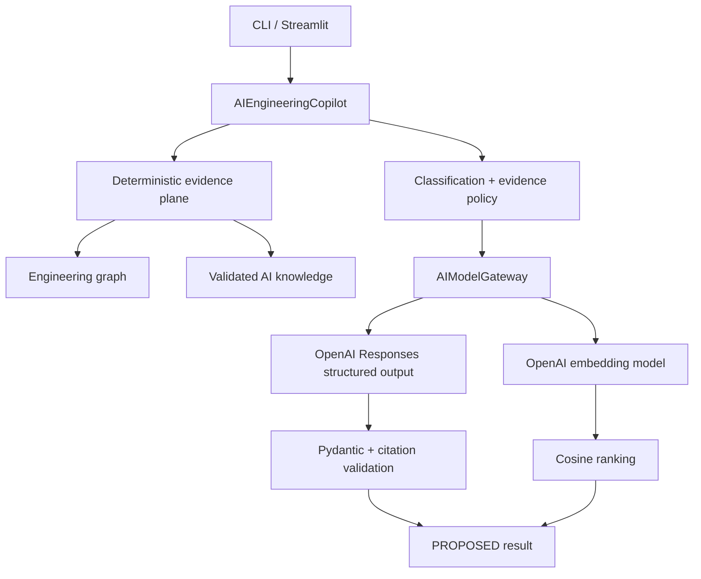

# TraceAI v2 AI architecture — Enhancements 1 through 6

## Architectural objective

TraceAI v2 adds real generative and embedding models without allowing a model to become the
source of engineering truth. Controlled IDs, test results, versions, baselines, graph links,
and release policy remain deterministic. Models produce proposals that an accountable engineer
must review.

## Runtime architecture

The default live configuration uses:

- `gpt-5.6` for structured root-cause, requirement, log, and test-generation output;
- `text-embedding-3-small` for candidate trace links and similar-defect retrieval;
- the OpenAI Python SDK `responses.parse(..., text_format=PydanticModel)` boundary;
- the Embeddings API followed by application-owned cosine similarity.

Both model names are CLI options. Changing a model does not change controlled release policy.

## Enhancement mapping

| # | Capability | Model operation | Deterministic control |
| --- | --- | --- | --- |
| 1 | Evidence-grounded RCA | Structured LLM generation | Failure localization and allowed evidence IDs |
| 2 | Semantic trace links | Text embeddings and similarity ranking | Candidate set, exclusions, `PROPOSED` status |
| 3 | Requirement-quality review | Structured LLM generation | Controlled requirement record and approval boundary |
| 4 | Engineering-log analysis | Structured LLM generation | Immutable log lines and evidence whitelist |
| 5 | Similar-defect retrieval | Text embeddings and similarity ranking | Controlled defect corpus and top-k selection |
| 6 | Test generation | Structured LLM generation | Context package, ID rules, trace checks, `PROPOSED` status |

## Trust boundaries

### Boundary 1 — controlled input

`ai_loader.py` validates `data/ai_knowledge.json` with `AIKnowledgeDataset`. Unknown fields,
missing records, duplicate IDs, and malformed values are rejected before a model call.

### Boundary 2 — data classification

The PoC permits live model calls only when the dataset classification is `SYNTHETIC`. This is a
deliberately restrictive demonstration policy. An enterprise implementation would replace it
with an approved data-classification, residency, retention, access-control, and vendor policy.

### Boundary 3 — structured output

The application sends a Pydantic output type to the Responses API. The SDK requests structured
output and returns a parsed model. The application still performs domain validation because
schema correctness does not prove engineering correctness.

### Boundary 4 — evidence whitelist

Every generative workflow supplies `allowed_evidence_ids`. After generation, TraceAI recursively
collects every `evidence_ids` value and rejects the entire response when any citation is not in
the controlled input package.

### Boundary 5 — application-owned provenance

The LLM cannot set:

- provider name;
- model name;
- prompt version;
- generation timestamp;
- live-model flag;
- data classification;
- final review decision.

The application attaches those values after output validation. Review state is always
`PROPOSED`.

### Boundary 6 — no release authority

`ReleaseEligibilityEngine` has no dependency on any AI module. AI can explain evidence and
recommend tests; it cannot approve requirements, accept trace links, change test results,
modify a baseline, close a defect, or mark a release eligible.

## Real mode and demo mode

| Mode | Provider | Network/API cost | Intended use |
| --- | --- | --- | --- |
| `--provider openai` | Real generation and embedding models | Yes | Live demonstration and evaluation |
| `--provider demo` | Deterministic templates and token hashing | No | CI, tutorial fallback, offline interview backup |

Demo mode is explicitly labelled `live_model_used=false`. It must never be presented as real
AI. CI tests the adapter contract with injected fake OpenAI clients and therefore never requires
an API key or spends model credits.

## Source layout

| File | Responsibility |
| --- | --- |
| `ai_models.py` | Input, draft, report, provenance, and generated-test contracts |
| `ai_loader.py` | Synthetic knowledge validation |
| `ai_prompts.py` | Versioned system prompts |
| `ai_gateway.py` | Real OpenAI and offline demo gateways; cosine similarity |
| `ai_services.py` | Six workflows, retrieval, citations, and governance |
| `ai_reporting.py` | Atomic JSON report writes |
| `ai_cli.py` | Provider selection and CLI orchestration |
| `data/ai_knowledge.json` | Synthetic requirements, artifacts, logs, defects, test context |

## Enterprise extension

For an automotive engineering deployment, replace the local synthetic adapter with read-only
connectors to approved ALM, PLM, Git, CI/CD, test, log, defect, and configuration systems.
Introduce tenant-aware authorization, secret management, private networking, prompt/output
audit, encryption, deletion and retention policies, model evaluation, human approval workflows,
and monitoring for retrieval quality, citation validity, latency, cost, and model drift.

## Official model-integration references

- [OpenAI Structured Outputs](https://developers.openai.com/api/docs/guides/structured-outputs)
- [OpenAI Embeddings](https://developers.openai.com/api/docs/guides/embeddings)
