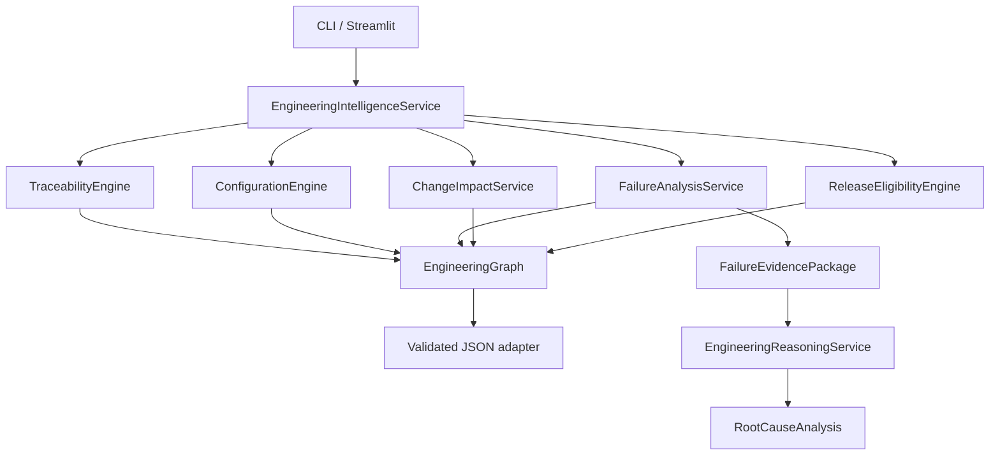

# Software architecture

## Components

## Dependency rule

Deterministic engines depend on the graph and domain contracts. They never depend on the
reasoning abstraction. The application layer may compose both. UI and CLI depend only on the
application use case, preventing duplicated business rules.

## Persistence boundary

`engineering_loader.py` is the current adapter. A production adapter may retrieve artifacts
from ALM, Git, test management, defect management, configuration, and release systems and
then populate the same `EngineeringDataset` contract.

## Scale path

For the four-day PoC, indexed in-memory traversal is simpler and more reliable than a graph
database. At enterprise scale, implement an audited relational/graph repository adapter,
pagination, incremental synchronization, access control, and immutable event history.

## v2 real-model extension

`AIEngineeringCopilot` adds a separate model plane for structured generation and semantic
embeddings. It consumes deterministic evidence but is not imported by traceability,
configuration, failure propagation, change impact, or release eligibility. See
[`ai_architecture.md`](ai_architecture.md) for the six workflows, model boundaries, evidence
whitelisting, application-owned provenance, and live-versus-demo modes.
